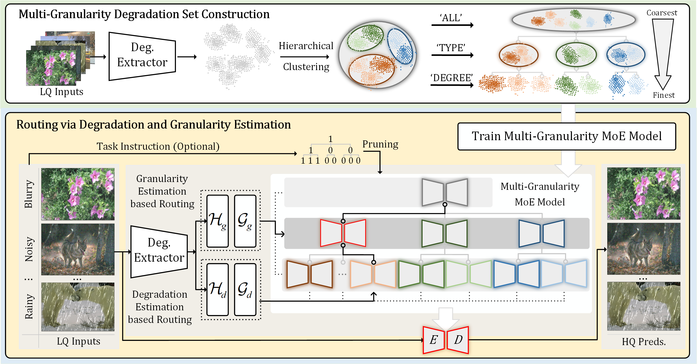
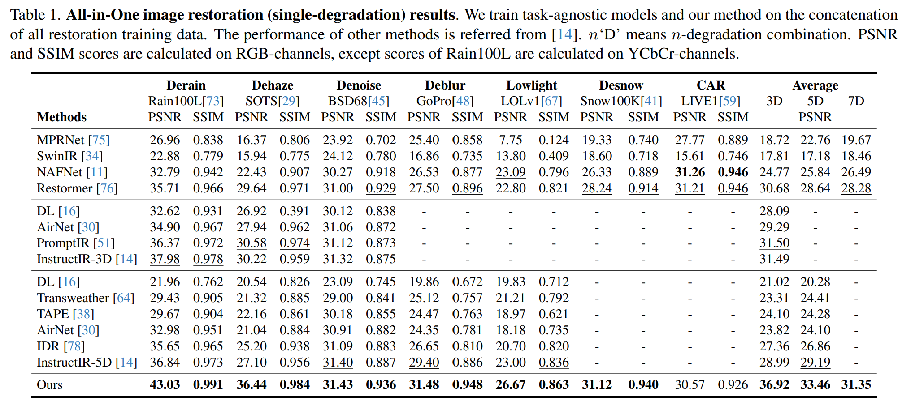
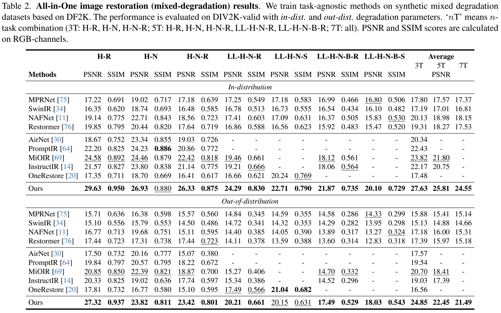
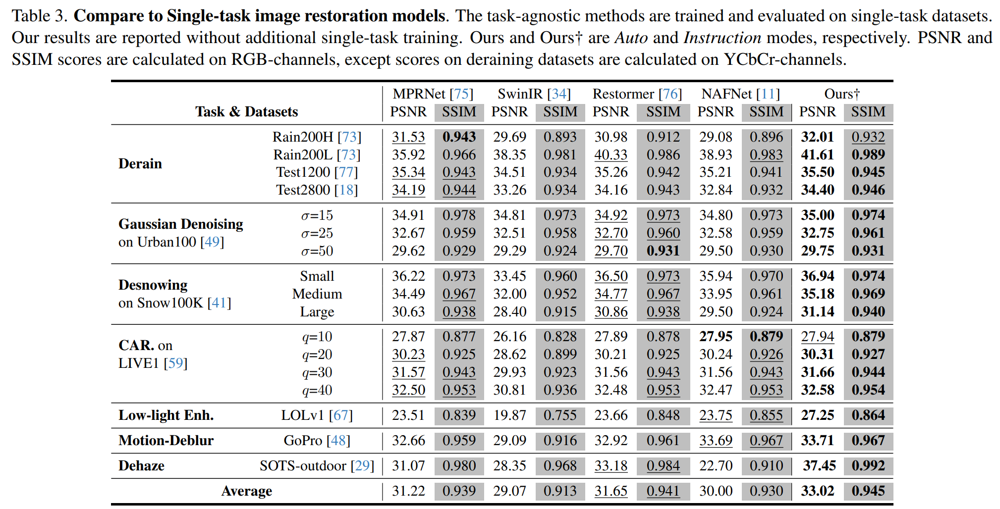

# UniRestorer: Universal Image Restoration via Adaptively Estimating Image Degradation at Proper Granularity

[Jingbo Lin](https://scholar.google.com/citations?user=zPycW30AAAAJ&hl=zh-CN&oi=ao), [Zhilu Zhang](https://scholar.google.com/citations?user=8pIq2N0AAAAJ&hl=zh-CN&oi=ao), [Wenbo Li](https://scholar.google.com/citations?user=foGn_TIAAAAJ&hl=zh-CN&oi=ao), [Renjing Pei](), [Hang Xu](https://scholar.google.com/citations?user=J_8TX6sAAAAJ&hl=zh-CN&oi=ao), [Hongzhi Zhang](https://scholar.google.com/citations?user=Ysk4WBwAAAAJ&hl=zh-CN&oi=ao), and [Wangmeng Zuo](https://scholar.google.com/citations?user=rUOpCEYAAAAJ&hl=zh-CN&oi=ao)

[]()
[](https://mrluin.github.io)


<hr />

> **Abstract:** *Recently, considerable progress has been made in all-in-one image restoration. Generally, existing methods can be degradation-agnostic or degradation-aware.
However, the former are limited in leveraging degradation-specific restoration, and the latter suffer from the inevitable error in degradation estimation.
Consequently, the performance of existing methods has a large gap compared to specific single-task models.
In this work, we make a step forward in this topic, and present our UniRestorer with improved restoration performance.
Specifically, we perform hierarchical clustering on degradation space, and train a multi-granularity mixture-of-experts (MoE) restoration model.
Then, UniRestorer adopts both degradation and granularity estimation to adaptively select an appropriate expert for image restoration.
In contrast to existing degradation-agnostic and -aware methods, UniRestorer can leverage degradation estimation to benefit degradation-specific restoration, and use granularity estimation to make the model robust to degradation estimation error.
Experimental results show that our UniRestorer outperforms state-of-the-art all-in-one methods by a large margin, and is promising in closing the performance gap to specific single-task models.* 
<hr />

### TODO


-  [x] **2024.12.31**: Paper and supplement files are release on ArXiv.
-  [ ] Inference code and pre-trained models release.
-  [ ] Datasets, training code release.


## Method


<p align="center"></p>

<p>  Our method has three steps, constructing multi-granularity degradation set, train multi-granularity MoE restoration model, train degradation and granularity estimation-based routing. </p>


## Comparisons


<details>
<summary><strong>All-in-One Image Restoration (single-degradation)</strong> (click to expand) </summary>

 
</details>
<details>

<summary><strong>All-in-One Image Restoration (mixed-degradation)</strong> (click to expand) </summary>
 
</details>

<details>

<summary><strong>Compare to Single-task Models</strong> (click to expand) </summary>
 
</details>

More comparison resuslts can be found in supplement material or our [website](https://mrluin.github.io).


[//]: # (## Dependencies )

[//]: # ()
[//]: # (---)


## Datasets

Following instructions in [DATA.md](./DATA.md) to download training and testing data.


[//]: # (## Training & Evaluation)

[//]: # ()
[//]: # (---)

[//]: # ()
[//]: # (Training instruction is provided in [TRAIN.md]&#40;./TRAIN.md&#41;.)


## Contact & Acknowledgement

If you have any questions, please contact [jblincs1996@gmail.com](jblincs1996@gmail.com).

We thank to the following image restoration works for their awesome backbones and code repos:

- [Restormer](https://github.com/swz30/Restormer)
- [RetinexFormer](https://github.com/caiyuanhao1998/Retinexformer)
- [DehazeFormer](https://github.com/IDKiro/DehazeFormer)
- [MiOIR](https://github.com/Xiangtaokong/MiOIR)
- [OneRestore](https://github.com/gy65896/OneRestore)

Our code is based on [BasicSR](https://github.com/XPixelGroup/BasicSR) and [KAIR](https://github.com/cszn/KAIR).


## Citation


If our work is helpful, you can cite our work as follows:
```
@article{lin2024unirestorer,
  title={UniRestorer: Universal Image Restoration via Adaptively Estimating Image Degradation at Proper Granularity},
  author={Lin, Jingbo and Zhang, Zhilu and Li, Wenbo and Pei, Renjing and Xu, Hang and Zhang, Hongzhi and Zuo, Wangmeng},
  journal={arXiv preprint arXiv:2412.20157},
  year={2024}
}
```
