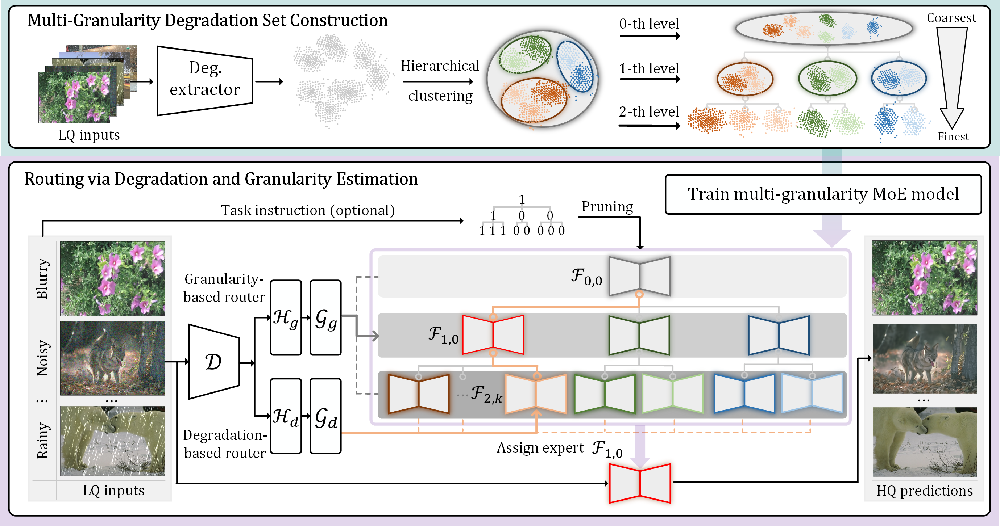

# [ICLR'26] UniRestorer: Universal Image Restoration via Adaptively Estimating Image Degradation at Proper Granularity

[Jingbo Lin](https://scholar.google.com/citations?user=zPycW30AAAAJ&hl=zh-CN&oi=ao), [Zhilu Zhang](https://scholar.google.com/citations?user=8pIq2N0AAAAJ&hl=zh-CN&oi=ao), [Wenbo Li](https://scholar.google.com/citations?user=foGn_TIAAAAJ&hl=zh-CN&oi=ao), [Renjing Pei](), [Hang Xu](https://scholar.google.com/citations?user=J_8TX6sAAAAJ&hl=zh-CN&oi=ao), [Hongzhi Zhang](https://scholar.google.com/citations?user=Ysk4WBwAAAAJ&hl=zh-CN&oi=ao), and [Wangmeng Zuo](https://scholar.google.com/citations?user=rUOpCEYAAAAJ&hl=zh-CN&oi=ao)

[]()
[](https://mrluin.github.io)

<hr />

> **Abstract:** *Recently, considerable progress has been made in all-in-one image restoration. Generally, existing methods can be degradation-agnostic or degradation-aware. However, the former are limited in leveraging degradation estimation-based priors, and the latter suffer from the inevitable error in degradation estimation. Consequently, the performance of existing methods has a large gap compared to specific single-task models. In this work, we make a step forward in this topic, and present our UniRestorer with improved restoration performance. Specifically, we perform hierarchical clustering on degradation space and train a multi-granularity mixture-of-experts (MoE) restoration model. Then, UniRestorer adopts both degradation and granularity estimation to adaptively select an appropriate expert for image restoration. In contrast to existing degradation-agnostic and -aware methods, UniRestorer can leverage degradation estimation to benefit degradation-specific restoration and use granularity estimation to make the model robust to degradation estimation error. Experimental results show that our UniRestorer outperforms state-of-the-art all-in-one methods by a large margin, and is promising in closing the performance gap to specific single-task models.*<hr />


## Method

<p align="center"></p>

<p>  Our method has three steps, constructing multi-granularity degradation set, train multi-granularity MoE restoration model, train degradation and granularity estimation-based routing. </p>


## Requirements 
1. Create conda environment
```
conda create -n UniRestorer python=3.8
conda activate UniRestorer
```
2. Install dependencies
```
torch==2.4.0+cu118
pip install matplotlib scikit-learn scikit-image opencv-python yacs joblib natsort h5py tqdm
pip install einops gdown addict future lmdb numpy pyyaml requests scipy tb-nightly yapf lpips
```


## Datasets

TODO

## Training & Evaluation

Training and evaluation instructions are provided in [TRAIN.md](./TRAIN.md).


## Acknowledgement

Thanks the help of [Zhilu Zhang](https://scholar.google.com/citations?user=8pIq2N0AAAAJ&hl=zh-CN&oi=ao).

Our code is mainly based on [BasicSR](https://github.com/XPixelGroup/BasicSR) and [KAIR](https://github.com/cszn/KAIR).
We thank to the following image restoration works for their awesome backbones and code repos:

- [Restormer](https://github.com/swz30/Restormer)
- [RetinexFormer](https://github.com/caiyuanhao1998/Retinexformer)
- [DehazeFormer](https://github.com/IDKiro/DehazeFormer)
- [MiOIR](https://github.com/Xiangtaokong/MiOIR)
- [OneRestore](https://github.com/gy65896/OneRestore)
- [DA-CLIP](https://github.com/Algolzw/daclip-uir)


## Contact
If you have any questions, please contact [jblincs1996@gmail.com](jblincs1996@gmail.com).


## Citation

If our work is helpful, you can cite our work as follows:
```
@inproceedings{
    lin2026unirestorer,
    title={UniRestorer: Universal Image Restoration via Adaptively Estimating Image Degradation at Proper Granularity},
    author={Jingbo Lin and Zhilu Zhang and Wenbo Li and Renjing Pei and Hang Xu and Hongzhi Zhang and Wangmeng Zuo},
    booktitle={The Fourteenth International Conference on Learning Representations},
    year={2026},
}
```